# Tabular Binary Classification ML & SHAP Consistency Pipeline

A complete, end-to-end workflow for **tabular binary classification and model interpretability**, including:

- data preparation and feature engineering  
- multiple machine learning models with hyperparameter tuning  
- rich model evaluation and visualization  
- SHAP-based model explainability  
- **cross-model SHAP direction consistency analysis** (custom extension)

All code is implemented in Python and contains **detailed in-line comments in Chinese**, making the project suitable as a reference template for similar tabular ML tasks.

> Note: The dataset in this repository is a small illustrative health-related dataset used purely for demonstration.  
> The workflow is generic and can be adapted to other binary classification problems.

---

## 1. What this project does

The code implements a full workflow from raw CSV to interpretable models:

1. **Data understanding & cleaning**
2. **Train/test split & baseline balance check**
3. **Feature engineering & variable selection**
4. **Model training & hyperparameter tuning**
5. **Model evaluation on validation and test sets**
6. **SHAP-based explainability for each model**
7. **Cross-model SHAP direction consistency analysis with radar plots**

The focus is on the **machine learning process and interpretability**, not on a specific disease.

---

## 2. Pipeline overview

### 2.1 Data understanding & exploration

Main capabilities:

- Load raw CSV from `data/raw/`.
- Inspect structure and basic statistics (`head`, `info`, missing counts).
- Summaries of the binary outcome distribution (frequency & proportion).
- Visual exploration of representative continuous features (e.g. histograms & boxplots).

Example figure (you can enable saving in code):

```
plt.savefig("results/performance/example_feature_distribution.png",
            dpi=300, bbox_inches="tight")
```

### 2.2 Data cleaning & missing value imputation

Main steps:

- Detect outliers in a continuous feature using IQR (interquartile range).
- Adjust clearly erroneous outliers based on simple rules.
- Use MissForest (random-forest-based imputation) to fill missing values in a continuous variable.
- Preserve integer type for appropriate variables after imputation.
- Save the cleaned & imputed dataset to:
    - data/processed/diabetes_imputed.csv (can be replaced by your own tabular dataset name).

---

### 2.3 Train/test split & baseline comparison

Main steps:

- Stratified split into training set and test set (e.g. 70/30, preserving outcome ratio).
- Output:
  - `train_data_notscaled.csv`
  - `test_data_notscaled.csv`
- Add a `group` variable (`train_set` / `test_set`) and use TableOne to produce a descriptive table
  comparing baseline characteristics between train and test.
- Save baseline balance table to:
  - `results/tables/varbalance_table.csv`

This makes it easy to check whether the split is reasonably balanced.

---

### 2.4 Feature engineering & variable selection

**Standardization**

- Continuous variables (e.g. age, laboratory measurements, indices) are standardized using
  `StandardScaler`.
- Fit the scaler on the training set, then apply to the test set.
- Output:
  - `train_data_scaled.csv`
  - `test_data_scaled.csv`

**Two complementary feature selection strategies**

1. **Univariable + multivariable logistic regression**
   - Fit univariable logistic models for each candidate predictor.
   - Select variables with significant p-values.
   - Fit a multivariable logistic regression on the selected set.
   - Save the multivariable regression results to:
     - `results/tables/results_mulvariable_df.csv`
   - Save the final selected variable list to:
     - `models/significant_vars.pkl`

2. **LASSO regression**
   - Fit a `Lasso` model on all candidate features.
   - Select features with non-zero coefficients.
   - Provides an alternative variable selection pathway to compare against logistic-based
     selection.

---

### 2.5 Model training & hyperparameter tuning

The project trains several models on standardized features:

- **Logistic Regression** (via `statsmodels.Logit` on non-scaled data)
- **Decision Tree** (CART)
- **Random Forest**
- **XGBoost**
- **LightGBM**
- **Support Vector Machine (SVM)**
- **Artificial Neural Network (ANN, MLPClassifier)**

For tree-based, ensemble and neural models:

- The original training set is further split into internal train/validation (e.g. 70/30).
- For each model:  
  1. Train a default-parameter version and record validation AUC.  
  2. Perform a manual grid search over key hyperparameters:
     - Decision Tree: `max_depth`, `min_samples_split`, `max_features`, `ccp_alpha`
     - Random Forest: `n_estimators`, `max_features`
     - XGBoost: `learning_rate`, `max_depth`, `n_estimators`, `subsample`
     - LightGBM: `learning_rate`, `num_leaves`, `n_estimators`, `subsample`, `colsample_bytree`
     - SVM: `C`, `kernel`, `gamma`, `degree`
     - ANN: `hidden_layer_sizes`, `activation`
  3. Choose the combination with highest validation AUC as the final model.

- All final models are saved into `models/`:
    - `logistic_model.pkl`
    - `tree_model.pkl`
    - `rf_model.pkl`
    - `xgb_model.pkl`
    - `lgb_model.pkl`
    - `svm_model.pkl`
    - `ann_model.pkl`
    - `significant_vars.pkl`

Additionally, the optimal decision tree structure is exported as:
- `results/performance/tree_structure.jpg`

---

### 2.6 Evaluation on internal validation set

For the validation set (used in tuning machine-learning models), the code computes:

- **Confusion matrices**
- **Accuracy**, **Precision**, **Sensitivity (Recall)**, **Specificity**, **F1-score**
- **AUC** and **95% confidence intervals** (using an analytical standard error approximation)

**Visualizations**:

- Confusion matrix heatmaps (via CM_plot)
- Individual ROC curves per model
- Combined ROC curves for all models
- Calibration curves (predicted vs observed probability)
- Decision Curve Analysis (DCA) curves

Representative figures (validation set):

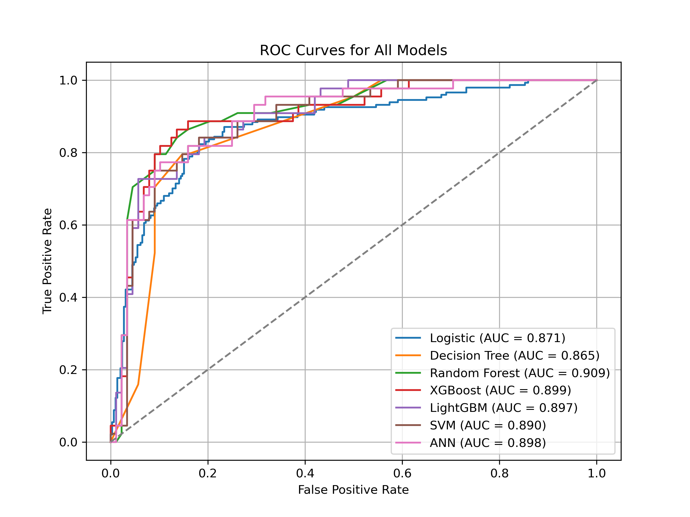

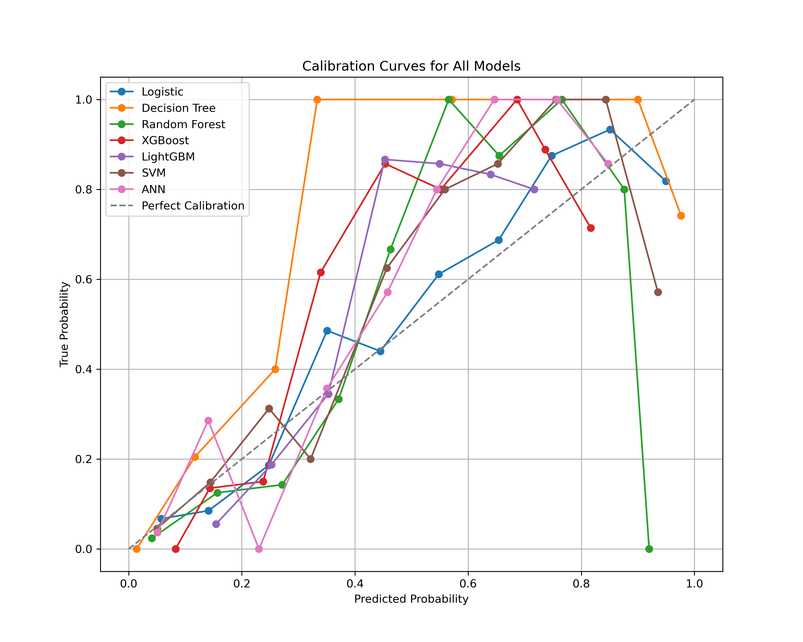

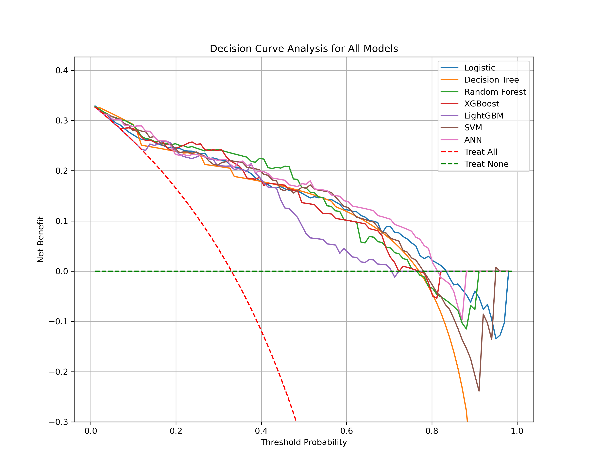

A summary table of metrics for all models on the validation set is stored as:
- `results/tables/model_performance_validation.csv`

---

### 2.7 Evaluation on external test set

The final models are then evaluated on the **held-out test set**, which was never used in training or tuning.

Computed metrics mirror those on the validation set:

- **Confusion matrices**
- **Accuracy**, **Precision**, **Sensitivity (Recall)**, **Specificity**, **F1-score**
- **AUC** and **95% confidence intervals** (using an analytical standard error approximation)

**Visualizations**:

- Combined ROC curves for all models  

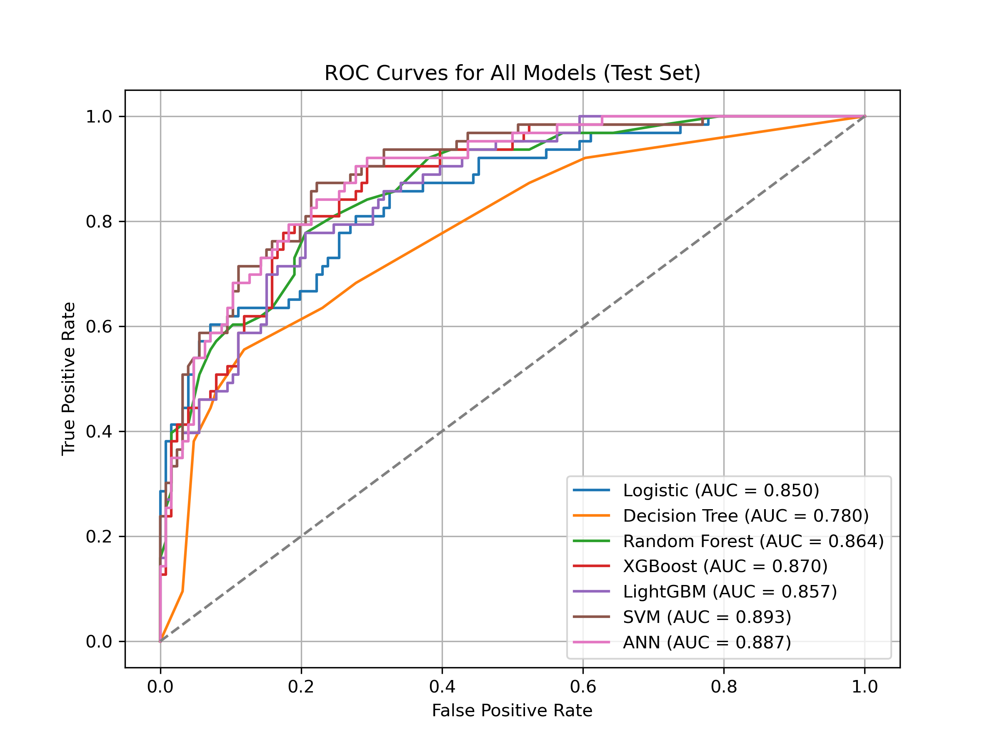

- Combined calibration curves

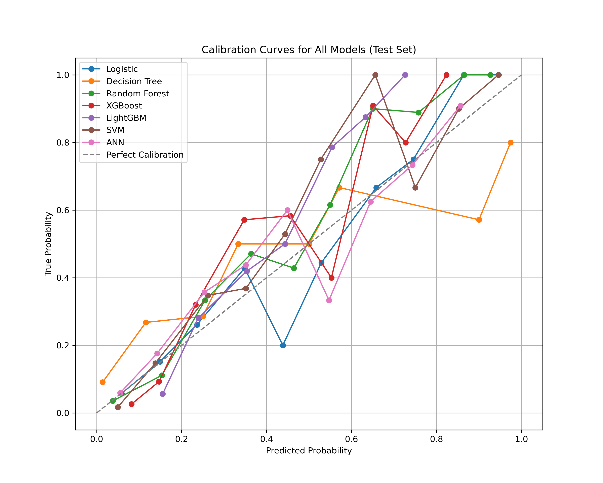

- Combined DCA curves

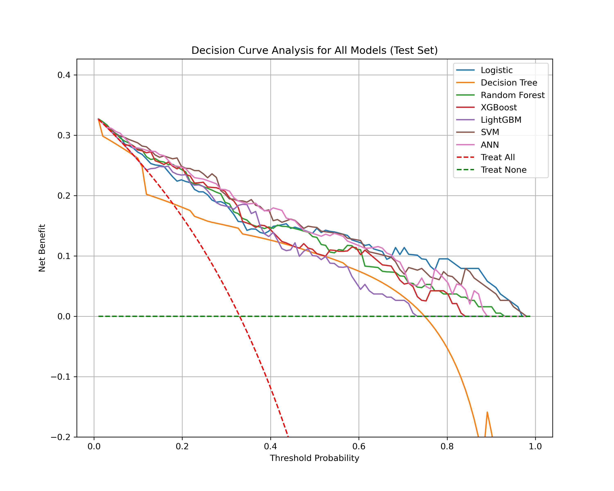

- Example single-model confusion matrices (e.g. SVM / ANN):


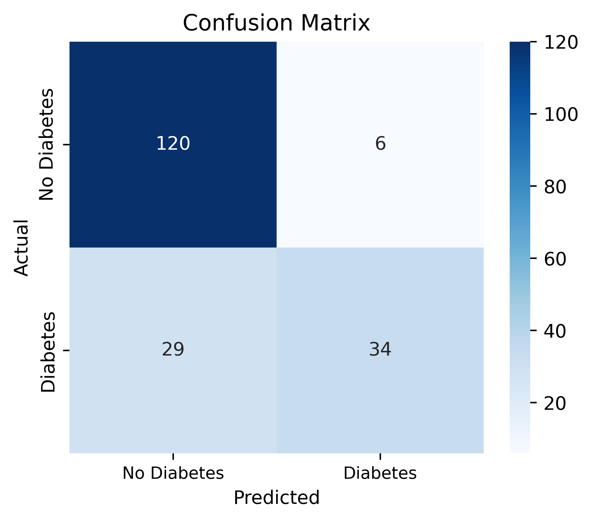

A summary table of test-set metrics for all models is stored as:

- `results/tables/model_performance_test.csv`

---

### 2.8 SHAP-based model explainability

The project uses **SHAP (SHapley Additive exPlanations)** for each individual model:

Supported models:

- Logistic regression
- Decision tree
- Random forest
- XGBoost
- LightGBM
- SVM
- ANN

Implementation details:

- Uses `shap.KernelExplainer` to provide a unified interface for all models.
- For each model, the following plots are generated:  
  1. **Global feature importance bar plot**  
  2. **Beeswarm plot** for global distribution of SHAP values  
  3. **Dependence / scatter plot** for a chosen feature, optionally colored by another feature  
  4. **Waterfall plot** for a selected individual observation  
  5. **Force plot** for:  
     - a single observation  
     - all interpreted observations
- All figures are saved under:
    - `results/shap`


Example images:

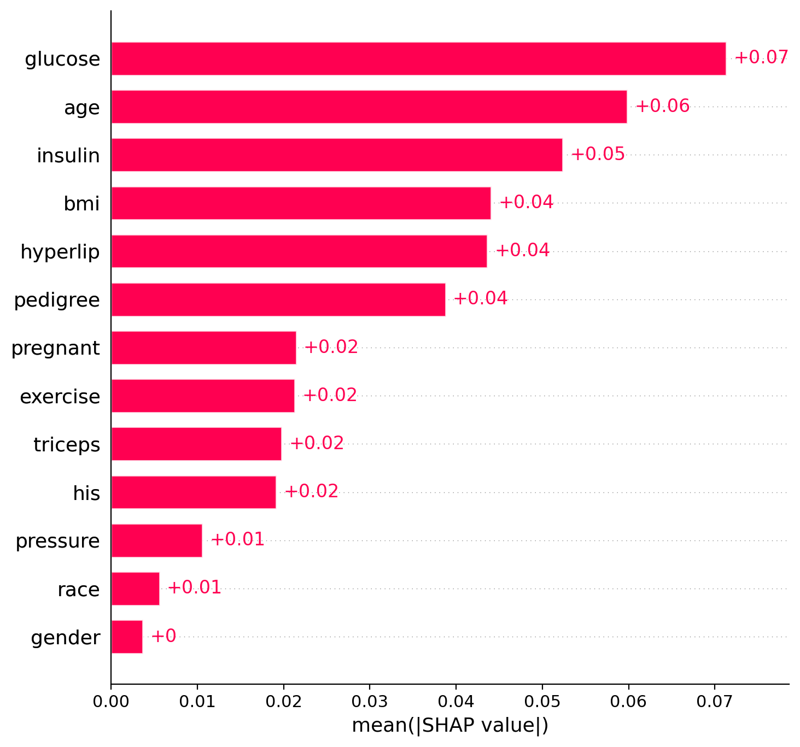

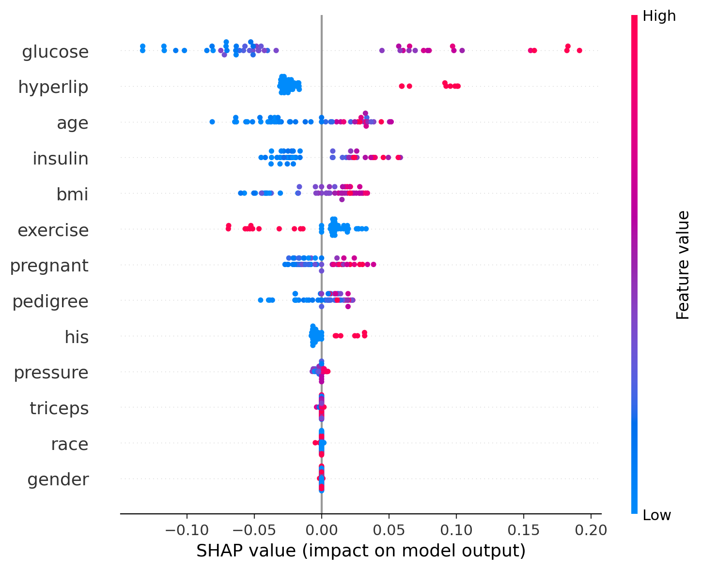

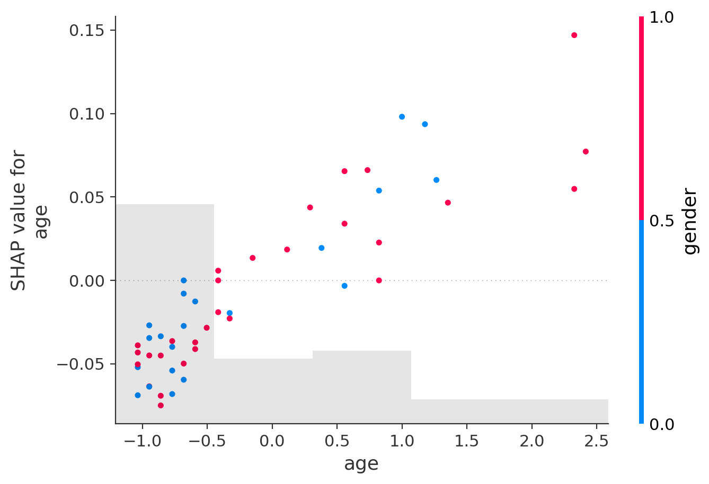

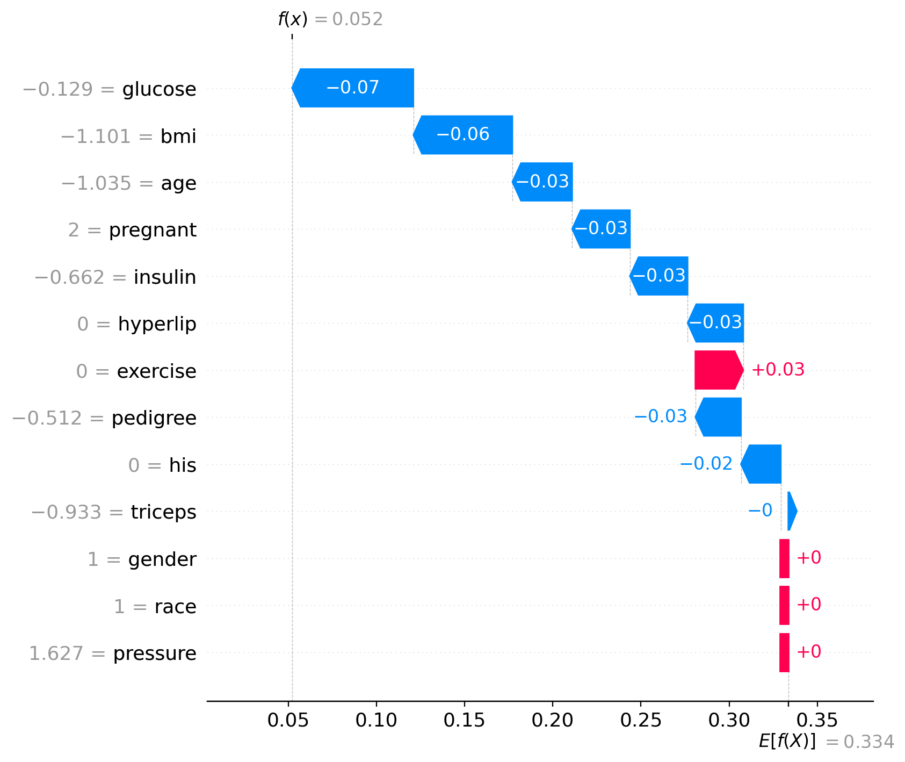

HTML force plots (interactive) are also generated, such as:

- `force_plot_all_rf.html`

- `force_plot_sig_5_ann.html`

- etc.

---

### 2.9 Cross-model SHAP direction consistency analysis

This is a **custom extension** beyond routine SHAP usage.

The goal is to answer:

> Do different models agree on **direction and monotonicity** of each feature’s effect, and how important is the feature across models?

#### 2.9.1 Setup

- Combine standardized training and test sets into one pool.
- Draw two subsets:
  - `bg_data`: background sample for SHAP explainer
  - `eval_data`: sample on which we compute SHAP values
- Models included in cross-model analysis:
  - Decision Tree
  - Random Forest
  - XGBoost
  - LightGBM
  - SVM
  - ANN  

*(The logistic model uses a different feature set and is not included here.)*

#### 2.9.2 Per-model SHAP statistics

For each model and each feature:

1. Compute SHAP values on `eval_data` using `KernelExplainer`.
2. For that feature, calculate **Spearman’s ρ** between:
   - feature values  
   - SHAP values
3. Record:
   - `spearman_r` (can be positive, negative, or near zero)
   - `sign`:
     - `+1` if ρ > threshold  
     - `−1` if ρ < −threshold  
     - `0` if |ρ| is small (direction uncertain)
4. Compute **mean(|SHAP|)** for each feature as a measure of feature importance within that model.

Raw results are saved as:

- `results/shap_consistency/shap_direction_signs_cross_models.csv`
- `results/shap_consistency/shap_meanabs_cross_models.csv`

#### 2.9.3 Aggregating across models

For each feature across all models:

- **Cross-model normalized importance** `I_norm`
  - For each model, normalize `mean(|SHAP|)` to `[0, 1]` within that model.
  - Average normalized importance over models to obtain `I_norm` in `[0, 1]`.

- **Direction consistency metrics**
  - `mean_r`: mean Spearman ρ over models (signed).
  - `S_abs = |mean_r|`: magnitude-only measure of direction + monotonic strength, in `[0, 1]`.
  - `Q_agree`: proportion of models whose sign(ρ) agrees with sign(`mean_r`), after treating small |ρ| as 0.
  - `S_abs_times_Q = |mean_r| × Q_agree`:  
    a stricter index combining effect strength and agreement rate.
  - `direction_txt`: "+" / "−" / "0" based on the average sign across models.

The summarized table is stored as:

- `results/shap_consistency/shap_direction_overall_cross_models.csv`

#### 2.9.4 Radar plot of cross-model consistency

The function `plot_shap_consistency_radar`:

- Selects the top `k` features by `I_norm`.
- Plots a **radar chart** with:
  - **Bars (purple–blue)**: cross-model normalized importance `I_norm`
  - **Blue line**: direction-consistency metric (chosen via `use_metric`):
    - `"S_abs"` → *Direction consistency (|mean ρ|)*
    - `"S_abs_times_Q"` → *Direction consistency (|mean ρ| × agreement)*
  - Feature labels with direction symbol, e.g. `feature_name (+)` / `(−)` / `(0)`.

An example figure:

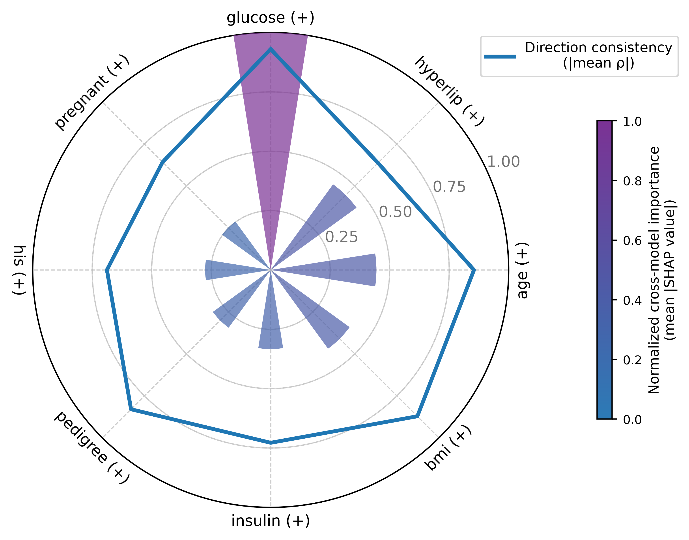

---

## 3. Repository structure

```text
.
├── data
│   ├── raw
│   │   └── diabetes_raw.csv             # example dataset (can be replaced)
│   └── processed
│       ├── diabetes_imputed.csv
│       ├── train_data_notscaled.csv
│       ├── test_data_notscaled.csv
│       ├── train_data_scaled.csv
│       └── test_data_scaled.csv
├── models
│   ├── logistic_model.pkl
│   ├── tree_model.pkl
│   ├── rf_model.pkl
│   ├── xgb_model.pkl
│   ├── lgb_model.pkl
│   ├── svm_model.pkl
│   ├── ann_model.pkl
│   └── significant_vars.pkl
├── results
│   ├── performance
│   │   ├── cm_*.png
│   │   ├── ROC_curves_allmodel_*.png
│   │   ├── Calibration_curves_allmodel_*.png
│   │   ├── DCA_curves_allmodel_*.png
│   │   └── tree_structure.jpg
│   ├── shap
│   │   ├── bar_*.png
│   │   ├── beeswarm_*.png
│   │   ├── scatter_*.png
│   │   ├── waterfall_*_*.png
│   │   └── force_plot_*.html
│   ├── shap_consistency
│   │   ├── shap_direction_signs_cross_models.csv
│   │   ├── shap_meanabs_cross_models.csv
│   │   ├── shap_direction_overall_cross_models.csv
│   │   └── shap_consistency_radar_top8.png
│   └── tables
│       ├── varbalance_table.csv
│       ├── results_mulvariable_df.csv
│       ├── model_performance_validation.csv
│       └── model_performance_test.csv
└── main.py
```

---

## 4. Environment & dependencies

Key Python dependencies:

- `numpy`, `pandas`
- `matplotlib`, `seaborn`
- `scikit-learn`
- `statsmodels`
- `xgboost`
- `lightgbm`
- `shap`
- `tableone`
- `missforest` (or equivalent implementation)

Example `requirements.txt`:

```text
numpy
pandas
matplotlib
seaborn
scikit-learn
statsmodels
xgboost
lightgbm
shap
tableone
missingpy
```

## 5. How to run

1. Clone the repository and move into the project folder.
2. Place the example dataset (or your own tabular binary dataset) under:

```
data/raw/diabetes_raw.csv
```

3. Install dependencies:

```
pip install -r requirements.txt
```

4. Run the main pipeline:

```
python main.py
```

5. Processed datasets, trained models and all result figures/tables will be written to:

`data/processed/`

`models/`

`results/`

---

## 6. Notes

- This repository provides a complete reference implementation for tabular binary classification and model interpretability.
- The dataset included is an example only and is **not intended for clinical decision-making**.
- The code is heavily commented in **Chinese**, making it easier for readers to follow the workflow and understand the methods step by step.

---

## Appendix: Example of Chinese in‑code comments

To make the implementation easier to follow, the code contains detailed Chinese comments. For example， the following snippet explains the logic of cross‑model SHAP direction consistency:

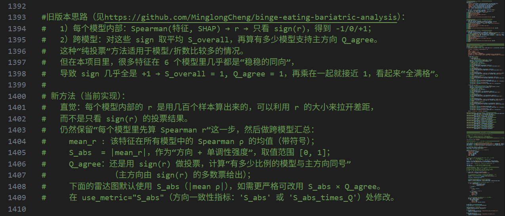


